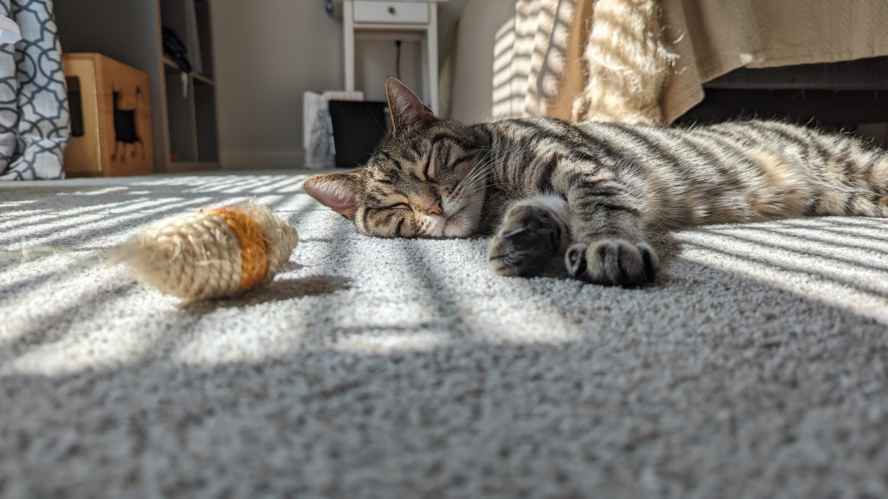
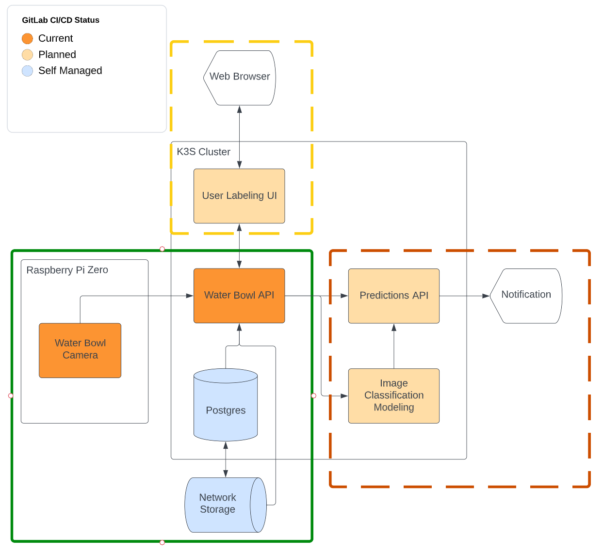
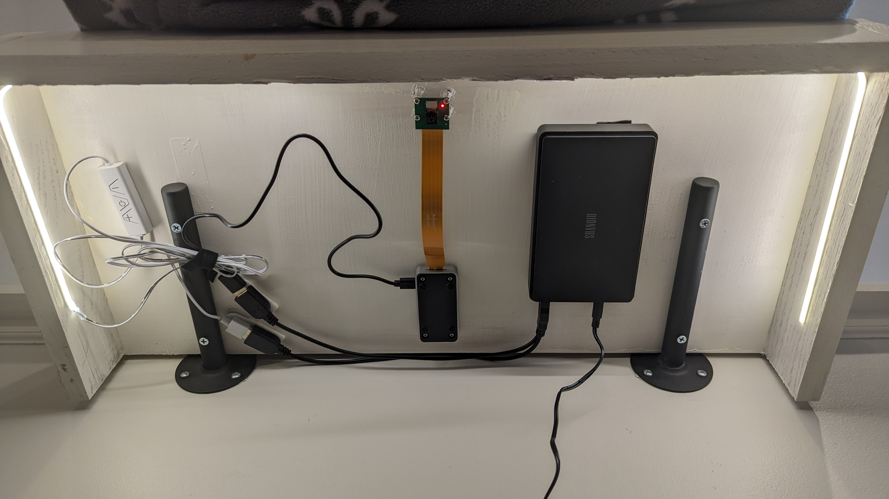

# Water Bowl API



## Description
This repo contains the code responsible for deploying and monitoring an API service running FastAPI for collecting and storing pictures taken by a Raspberry Pi.


I had noticed on a couple of occasions that my cat had been desperate for something to drink, not realizing that her Petkit water bowl
was actually completely dry. The only indication that the device provides is a small red led on the bottom of the bowl, and since the 
water pump runs intermittently, it's sometimes difficult to tell that it's running correctly. One at least one occasion, my cat has gone
24 hours without access to water, which is scary when I'm home, but potentially deadly if I'm away with no one checking in on her.

To solve this problem, I've set about creating an automated ML pipeline to monitor this waterbowl and notify me when it is empty

## Design and Resources

This repo contains all of the code responsible for deploying and running an API to collect, crop, and store images of my cat's water bowl.
Currently this repo only handles storage. The next phase, marked in yellow, will add in the ability to retrieve and label these images in preparation for the final step, marked in red.
This will be an automated ML pipeline to generate classification models, which will be deployed into a predictions API to notify me if the system detects the waterbowl is empty.



This API is designed to receive pictures taken by this camera system.



The Raspberry Pi Zero W powering the Arducam Camera is powered by a 10,000mAh UPS that can keep it running for 24 hours should
the house lose power (this isn't really needed, but why engineer when you can over engineer).

The home lab powering this system is a 6 node Raspberry Pi 4 cluster, with an additional Raspberry Pi running a local GitLab instance
for CI/CD. This repository is mirrored from my local GitLab.

## Installation

This project was built using Python 3.9, and I've run it on Python 3.11, but your milage may vary.

If you wish to try running this code yourself create a virtual environment and run

```python
pip3 install -r requirements
```

## Development

This project can be run locally with a dockerized postgres instance for storage, or in a docker-compose network.
In either case, it's recommended to manually add an image via a POST request to `localhost:8080/pictures/` if you plan on running this alongside the UI for development.

## Contributing
Please feel free to fork this repository as you wish! As I said earlier, this repo is mirrored from a locally managed GitLab instance,
so I can't accept PRs here. However, feel free to generate issues if you'd like, and we can discuss implementation ideas there.

## License
This project is GNU GPL-3 licensed.

## Project status
This project is currently in active development.
